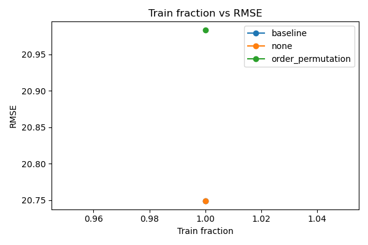
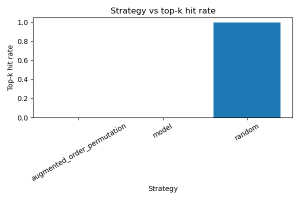
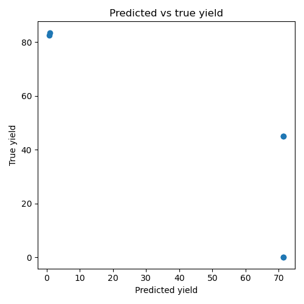

# Buchwald-Hartwig Augmentation Report

## Dataset Summary
No dataset summary file found.

## Baseline Metrics Summary
| model | split | metric | value |
| --- | --- | --- | --- |
| ridge | test | mae | 20.444446563720703 |
| ridge | test | rmse | 21.034365615461148 |
| ridge | valid | mae | 20.000001907348633 |
| ridge | valid | rmse | 20.46406263628621 |

## Augmentation Metrics Summary
| augmentation | model | split | metric | value |
| --- | --- | --- | --- | --- |
| none | ridge | test | mae | 20.444446563720703 |
| none | ridge | test | rmse | 21.034365615461148 |
| none | ridge | valid | mae | 20.000001907348633 |
| none | ridge | valid | rmse | 20.46406263628621 |
| order_permutation | ridge | test | mae | 20.056737899780273 |
| order_permutation | ridge | test | rmse | 21.86920234235748 |
| order_permutation | ridge | valid | mae | 18.2553186416626 |
| order_permutation | ridge | valid | rmse | 20.09697010612314 |

## Low-Data Curve Summary
| source | train_fraction | augmentation | value |
| --- | --- | --- | --- |
| augmentation | 1.0 | none | 20.749214125873678 |
| augmentation | 1.0 | order_permutation | 20.98308622424031 |
| baseline | 1.0 |  | 20.749214125873678 |

## Hard Split Summary
No held-out group split metrics found.

## Recommendation Simulation Summary
| strategy | model | k | top_k_hit_rate | regret | experiments_to_first_hit |
| --- | --- | --- | --- | --- | --- |
| random |  | 2 | 1.0 | 0.0 | 1 |
| model | ridge | 2 | 0.0 | 38.5 | 3 |
| augmented_order_permutation | ridge | 2 | 0.0 | 38.5 | 3 |

## Plots
- 
- 
- 

## Augmentation Helped / Hurt / Neutral
Augmentation hurt: baseline=20.75, augmented=20.98.
